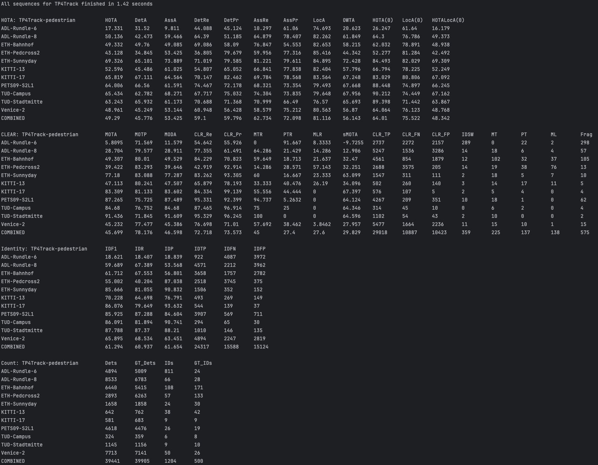
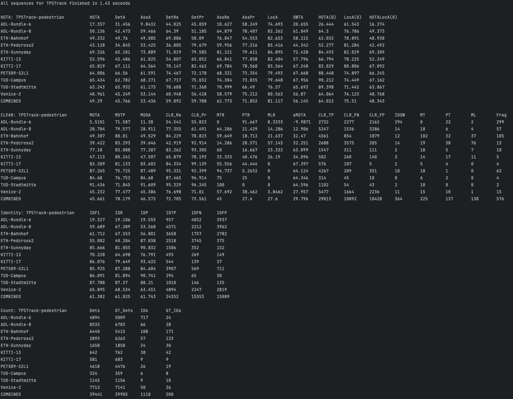

Auteur:
Louis PAGNIER

# Visual Object Tracking Project

## Préambule

Ceci est le rapport Markdown, il inclut les vidéos des résultats de mon algorithme pour chaque TP si on le visualise depuis GitHub.

## Introduction

Ce projet vise à implémenter un tracker multi-cibles (dans notre cas de personnes). Le projet est découpé en 5 TPs impliquants une amélioration continue du projet à chaque étape.

Les étapes sont les suivantes:

* **TP1**: Implémentation d'un filtre de Kalman pour prédire la position d'une balle.
* **TP2**: Association des détections entre 2 frames grâce l'IoU *(Intersection Over Union)*
* **TP3**: Utilisation de l'algorithme hongrois pour déterminer la meilleure distribution de la matrice de similarité.
* **TP4**: Application du filtre de Kalman développé dans le TP1 à notre algorithme actuelle.
* **TP5**: Ajout d'un modèle de deep learning capable d'extraire des vecteurs de features et mesure de nos algorithmes à l'aide du script TrackEval.

<span style="color: red">Les 5 TPs se trouvent dans le dossier **src/**</span>.
Le premier TP est dans son dossier à part, tandis que les TP2-5 sont directement à la racine du dossier `src/`.

### Architecture du projet

```
.
├── README.md                               // Rapport Markdown (GitHub)
├── Report.pdf                              // Rapport PDF (sans vidéos)
├── assets                                  // Images nécéssaires au rapport
├── pyproject.toml                          // Dépendances pour Poetry
└── src                                     // Code des 5 TPs
    ├── TP1
    │   ├── Detector.py
    │   ├── KalmanFilter.py
    │   ├── objTracking.py
    │   └── randomball.avi
    ├── tp2.py
    ├── tp3.py
    ├── tp4.py
    ├── tp5.py
    ...
    ├── img1
    |   └── ...                             // Dataset MOT15 ADL-Rundle-6
    ├── det
    │   └── det.txt                         // Détections fournies
    └── results                             // Résultats des identifications
        ├── TP3.txt
        ├── TP4.txt
        └── TP5.txt
    
    

```

## TP1

Dans ce TP, j'ai implémenté la classe `KalmanFilter` avec les formules données dans le PDF.

Ce filtre possède une méthode `__init__` qui permet d'initialiser les données internes du filtre nécéssaires aux calculs.

Il y a également les méthodes `predict` et `update` permettant respectivement de prédire la prochaine position à partir des positions précédentes, et la seconde de mettre à jour la position actuelle à partir d'une vérité terrain.


## TP2

Pour ce TP ainsi que les TP suivants, le jeu de données utilisé est: *MOT15 ADL-Rundle-6*.

L'algorithme de mon programme est découpé en plusieurs étapes:

1. Création d'un dictionnaire comprenant toutes les détections groupées par n° de frame. (1ère partie de `process_frames`.
2. Ensuite, pour chaque frame, je calcul la matrice de similarité entre cette frame et celle d'après: `compute_similarity_matrix(detections_dict, i_frame, i_frame + 1)`.
3. Pour chaque détection, je prend celle *dans la frame suivante* qui est le plus similaire, et je lui assigne l'identifiant de celle qui lui correspond le plus *dans la frame actuelle*.

### Algorithme Principale

```py
def process_frames(detections_lines, sigma_iou):

    # On commence par créer un dictionnaire contenant les détections pour chaque frame
    detections_dict = {}
    for detection in detections_lines:
        detection = detection.split(',')
        frame, _, x, y, width, height, conf, _, _, _ = [int(float(d)) for d in detection]
        if frame not in detections_dict:
            detections_dict[frame] = []
        detections_dict[frame].append([x, y, width, height, conf, None])

    # On traite chaque frame en utilisant la matrice de similarité
    counter = 0
    for i_frame in range(1, 526):
        matrix = compute_similarity_matrix(detections_dict, i_frame, i_frame + 1)
        
        for i in range(len(matrix)):
            max_iou = max(matrix[i])

            if detections_dict[i_frame][i][5] is None:
                # Si la détection n'a pas encore d'identifiant,
                # on lui en assigne un nouveau
                detections_dict[i_frame][i][5] = counter
                counter += 1

            if max_iou > sigma_iou:
                # Si la détection a une similarité suffisante avec une autre 
                # détection, on lui assigne le même ID
                j = matrix[i].index(max_iou)
                detections_dict[i_frame + 1][j][5] = detections_dict[i_frame][i][5]

```
Avec pour chaque détection `dict[5] = id`.

## TP3

Ce TP reprend le principe du TP précédent mais ajoute l'*algorithme hongarien* afin d'attribuer à chaque track une *unique* détection en trouvant la combinaison maximisant le score total.

Pour utiliser cet algorithme, j'ai utilisé comme indiqué dans le PDF la fonction `linear_sum_assignment` du module `scipy.optimize`.

Mon programme pour ce TP reprend une grande partie du précédent, mais j'ai tout de même refactorisé une partie du code pour qu'il soit plus simple à utiliser pour les TPs suivants.

### Algorithme de mise à jour des tracks

```py
def update_tracks(tracks, detections_dict, i_frame, sigma_iou, counter):

    matrix = compute_similarity_matrix_hungarian(detections_dict[i_frame], tracks)
    row_ind, col_ind = hungarian_algorithm(matrix)

    for i in range(len(row_ind)):
        # Si le match l'IoU est trop faible, on supprime la track (id: -1)
        if matrix[row_ind[i]][col_ind[i]] < sigma_iou:
            tracks[col_ind[i]][5] = -1
        # Sinon, on met à jour la track par rapport à la détection associée
        else:
            track_id = tracks[col_ind[i]][5]
            tracks[col_ind[i]] = detections_dict[i_frame][row_ind[i]]
            tracks[col_ind[i]][5] = track_id
            tracks[col_ind[i]][6] = matrix[row_ind[i]][col_ind[i]]

    # Ici, on créé une nouvelle track pour chaque détection qui n'en a pas
    for i in range(len(detections_dict[i_frame])):
        if detections_dict[i_frame][i][5] is None:
            detections_dict[i_frame][i][5] = counter[0]
            tracks.append(detections_dict[i_frame][i])
            
            # counter est une liste pour que la valeur soit passée par référence
            counter[0] += 1

    # On filtre les tracks pour retirer celles marquées comme supprimées
    tracks = [track for track in tracks if track[5] != -1]
    
    return tracks
```


## TP4

Le filtre de Kalman permet d'améliorer la précision de l'alogrithme car il va essayer de déterminer la prochaine position d'une détection en fonction de ses positions précédentes. Ainsi, on peut s'en servir pour calculer l'IoU entre cette prédiction et les détections de la frame suivante.

L'implémentation du filtre de Kalman au programme m'a fait revoir une grande partie du code. En effet, maintenant mes listes ne contiennent plus des listes de nombres mais des objet `Track` enveloppant un filtre `KalmanFilter`.

```py
class Track:
    def __init__(self, x, y, width, height, conf_d, track_id = None):
        self.width = width
        self.height = height
        self.centroid = (x + width / 2, y + height / 2)
        self.old_centroid = self.centroid
        self.conf_d = conf_d
        self.conf_h = 1
        self.track_id = track_id
        self.kalman_filter = KalmanFilter(dt=0.3, u_x=1, u_y=1, std_acc=1,
                                          x_std_meas=0.1, y_std_meas=0.1, 
                                          start_x=self.centroid[0],
                                          start_y=self.centroid[1])
        self.predict()

    def get_coordinates(self) -> Tuple[int, int, int, int]:
        # Retourne les coordonnées actuelles de la track: (x, y, largeur, hauteur)
        x = self.kalman_filter.x_k_[0][0] - self.width / 2
        y = self.kalman_filter.x_k_[1][0] - self.height / 2
        return x, y, self.width, self.height

    def predict(self) -> None:
        # Met à jour la track avec la prédiction du filtre de Kalman
        tmp_centroid = self.kalman_filter.x_k_[0][0], self.kalman_filter.x_k_[1][0]
        self.kalman_filter.predict()
        self.old_centroid = tmp_centroid
        self.centroid = self.kalman_filter.x_k_[0][0], self.kalman_filter.x_k_[1][0]

    def update(self, z_k: np.ndarray) -> None:
        # Met à jour la track avec une vraie détection
        self.kalman_filter.update(z_k)
        self.centroid = self.kalman_filter.x_k_[0][0], self.kalman_filter.x_k_[1][0]

    def clone(self) -> 'Track':
        # Créer une copie de la track
        x = self.kalman_filter.x_k_[0][0] - self.width / 2
        y = self.kalman_filter.x_k_[1][0] - self.height / 2
        return Track(x, y, self.width, self.height, self.conf_d, self.track_id)
```

Pour ce TP, les trois grandes étapes de l'algorithmes sont les suivantes:

```py
# On prédit la position des tracks
for track in tracks:
    track.predict()
    
# On associe les détections aux tracks, et on crée de nouvelles tracks si nécessaire
tracks = update_tracks(tracks, detections_dict, i_frame, sigma_iou, counter)

# On met à jour la position des tracks avec les détections associées
for track in tracks:
    for detection in detections_dict[i_frame]:
        if track.track_id == detection.track_id:
            new_x = detection.centroid[0]
            new_y = detection.centroid[1]
            track.update(np.array([[new_x], [new_y]]))
            break
```


## TP5

Dans ce dernier TP, j'ai ajouter au calcul de similarité du score une similarité cosinus entre les vecteurs de features des détections.

Pour obtenir les vecteurs de features, j'ai utlisé le modèle *ResNet18* pré-entraîné sur *ImageNet*.

Pour obtenir les vecteurs de features, il faut récupérer l'avant-dernière couche du modèle.

Je fais ensuite une moyenne entre l'IoU et la similarité cosinus pour obtenir le score final qui sera ensuite passé à l'algorithme hongrois.

## Résultats

Voici les résultats obtenus l'aide du script `TrackEval` sur les TP3, 4 et 5.

### TP3


### TP4



### TP5



Si on compare les métriques principales, on a le tableau suivant:

| TP    | HOTA      | MOTA      | IDF1      |
| ---   | :-:       | :-:       | :-:       |
| TP3   | 17.577    | 6.628     | 19.715    |
| TP4   | 17.331    | 5.890     | 18.621    |
| TP5   | 17.357    | 5.510     | 19.327    |


J'obtiens les meilleurs résultats avec le TP3 seul (l'algorithme hongrois).
En ajoutant le filtre de Kalman, les performances baissent. On peut essayer d'expliquer ça par le fait que les détections fournies dans `det.txt` sont un peu chaotiques et semblent se téléporter, ce qui fait faire des mauvaises prédictions au filtre de Kalman.